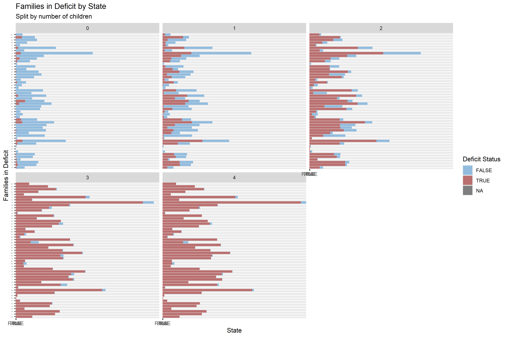

Kids In This Economy: A Financial Feasibility Study
================
Joel Torres
4/22/2025

## Abstract

This project investigates the financial burden of raising children
across U.S. counties using a cleaned cost of living dataset. By
comparing median family income to total household costs, we assess
whether families are operating at a surplus or deficit. Visualizations
and regression analysis reveal that even one child can push many
families into financial strain, with the deficit sharply increasing with
each additional child. The findings highlight the structural economic
challenges that discourage family growth and suggest that current
incentives may be insufficient to reverse trends toward population
decline. This analysis underscores the urgent need for policy reforms to
support family sustainability in America.

## Getting Started

**Before running this document, install packages with:**
install.packages(c(“tidyverse”, “ggplot2”, “scales”, “rio”))

``` r
knitr::opts_chunk$set(echo = TRUE)
#Importing packages
library(rio)
library(tidyverse)
library("ggplot2")
library(scales)
```

**AND ensure the path to the data is correct**

You can download the cleaned (in SQL) data
[here](https://drive.google.com/file/d/1Hs67_g3ki1b4YYeYwLMvQhrgUlAHMH2o/view?usp=sharing).

``` r
#Reads in the data
col_data<-rio::import("C:\\Users\\joelt\\Downloads\\Jtorres Google Data Analytics Capstone\\cleaned_col.csv")
```

## Cleaning the Data

For further use in R, I first cleaned the [original
data](https://www.kaggle.com/datasets/asaniczka/us-cost-of-living-dataset-3171-counties/data)
by doing the following in sheets and sql: -Removing unnecessary data
(area name, metro boolean, etc) -Extracting specific family count data
from its original format (string to two separate integer values) -Sorted
by state, county, and number of children in that order

## Remaining Income Analysis

The first metrics that caught my eye were the total cost and family
income. I first looked at how many families were in a deficit or not by
state.  

I then split it up by just the number of children and the number of
parents rather than by state.

I noticed that in many of the states, having even just one child is
enough to put families in the red for over a quarter of the population.
What’s worse, the amount of families in financial deficit can nearly
double or more with 2 children. The US has a population replacement rate
of 2.1 children per women in the US, so if for the majority of Americans
having 2 children remains financially unviable, the US will begin facing
an issue just as hard to reverse as global warming; population
collapse[^1]. You can see with the second chart how sharp the difference
in remaining income can be. For many families, proposed incentives for
having children are only band-aid solutions, like the \$5,000 incentive
proposed by President Trump per child, which will only barely cancel out
the deficit of most struggling families. It is not enough to simply
bring these families out of the red, financial stability does not mean
living paycheck to paycheck.

I also looked at what the median incomes with the remaining incomes
could tell us.

A higher income always helps when talking about issues of costs, but
with the current income stagnation in the US, purchasing power is alot
harder to come by. The majority of families in a deficit are in places
with a median income of less than \$100,000, which accounts for over 50%
of Americans[^2], and with receiving a higher income being unlikely,
it’s plausible to say that finances are a major deterrent towards
childbirth. With the cost of living increasing with stagnant wages,
Americans will do what they can to control their quality of life, and
one of the first things they can control is their family size.

The last metric I looked at was the approximate effect every additional
child can have on one’s finances. I fit a linear regression model to the
remaining income data to examine how an extra child will affect it,
finding that the remaining income was reduced by -1,251 dollars per
child.


The final chart displaying the linear regression model sheds light on
the impact of additional children on a family’s remaining income. This
reduction, demonstrated through the linear regression line, further
amplifies the financial strain that families already experience. Given
the trends we observed in the other charts, where even a single child
can push a family into deficit, this additional financial burden due to
an extra child makes it even harder for families to manage their
expenses. This pattern of diminishing income suggests that financial
insecurity is not just a result of living paycheck to paycheck, but a
deeper structural issue related to the economic pressures of raising
children. Therefore, the model reinforces the idea that without
significant financial intervention or policy change, the financial
viability of having children in the U.S. will continue to deteriorate,
contributing to broader societal concerns such as population collapse
and economic stagnation.

[^1]: University of Pennsylvania Wharton Budget Model. (2024, March 22).
    *US Demographic Projections With and Without Immigration*. Retrieved
    from
    <https://budgetmodel.wharton.upenn.edu/issues/2024/3/22/us-demographic-projections-with-and-without-immigration>

[^2]: “Percentage distribution of household income in the U.S. 2022”,
    Statista,
    <https://www.statista.com/statistics/203183/percentage-distribution-of-household-income-in-the-us/>
